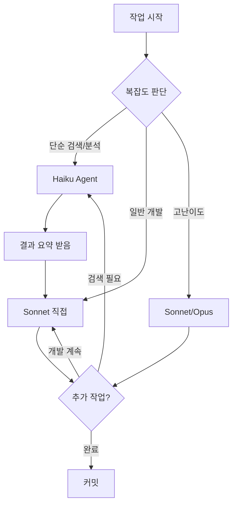

# Claude Code 토큰 최적화 전략

## 📋 개요

**목표**: 200,000 토큰 한도 내에서 최대한 효율적으로 작업 수행

**현재 상황** (2026-04-02):
- 사용: 117,078 / 200,000 (58.5%)
- 남은: 82,922 (41.5%)
- 작업: Backend + Frontend Provider UI 구현 (복잡한 다중 파일 수정)

**작성일**: 2026-04-02
**관련 문서**: `CLAUDE.md`, `PHASE1_PROVIDER_UI_PLAN.md`

---

## 🎯 핵심 전략

### 1. 역할별 모델 구분 (Model-per-Task)

Claude Code는 3가지 모델을 제공합니다:

| 모델 | 특징 | 토큰 비용 | 속도 | 적합한 작업 |
|------|------|----------|------|------------|
| **Opus** | 최고 성능 | 높음 | 느림 | 복잡한 아키텍처 설계, 난이도 높은 버그 |
| **Sonnet** | 균형 잡힘 (기본) | 중간 | 중간 | 일반적인 개발 작업, 코드 리뷰 |
| **Haiku** | 빠르고 저렴 | 낮음 | 빠름 | 단순 검색, 파일 읽기, 반복 작업 |

#### 권장 매핑

```yaml
# 복잡한 작업 (10% 비중) - Sonnet/Opus
- 아키텍처 설계
- 복잡한 버그 디버깅
- 새로운 기능 설계
→ 기본 세션 사용 (Sonnet) 또는 명시적 Opus 요청

# 일반 작업 (60% 비중) - Sonnet
- 코드 작성/수정
- 컴포넌트 구현
- API 통합
→ 기본 세션 사용 (Sonnet)

# 단순 작업 (30% 비중) - Haiku
- 파일 검색 (Glob/Grep)
- 로그 확인
- 문서 작성
- 반복적인 CRUD 작업
→ Task tool에서 model="haiku" 지정
```

---

## 🔧 구체적인 최적화 방법

### A. Task Tool 활용 시 모델 지정

**Before** (비효율적):
```
사용자: "backend/app/api 폴더에서 모든 .py 파일 찾아줘"
→ Sonnet이 직접 검색 (비싼 토큰 사용)
```

**After** (효율적):
```python
Task tool 호출:
{
  "subagent_type": "Explore",
  "model": "haiku",  # ⭐ Haiku 사용!
  "description": "Find Python files",
  "prompt": "backend/app/api 폴더에서 모든 .py 파일을 찾아서 목록 반환"
}
```

**절감 효과**: 약 60% 토큰 절약

---

### B. 작업 복잡도별 전략

#### 🟢 단순 작업 → Haiku Agent

```yaml
작업 예시:
  - 파일 검색: "providers 관련 파일 찾기"
  - 로그 분석: "에러 메시지 필터링"
  - 문서 업데이트: "README에 새 섹션 추가"
  - 반복 작업: "10개 컴포넌트에 동일한 수정 적용"

사용 방법:
  Task(
    subagent_type="Explore",
    model="haiku",
    prompt="..."
  )
```

#### 🟡 중간 작업 → Sonnet (기본)

```yaml
작업 예시:
  - 새 API 엔드포인트 추가
  - 컴포넌트 작성
  - 버그 수정
  - 테스트 작성

사용 방법:
  - 기본 세션에서 직접 작업
  - 또는 Task(subagent_type="...", model="sonnet")
```

#### 🔴 복잡한 작업 → Sonnet/Opus

```yaml
작업 예시:
  - 아키텍처 마이그레이션 계획
  - 복잡한 버그 (여러 파일 관련)
  - 성능 최적화 전략
  - 보안 취약점 분석

사용 방법:
  - 기본 세션 사용 (Sonnet)
  - 매우 어려운 경우: 명시적으로 "Opus 모델 사용해줘" 요청
```

---

### C. 파일 읽기 최적화

#### ❌ 비효율적인 패턴

```python
# 전체 파일을 반복적으로 읽음 (토큰 낭비)
Read("main.py")           # 400줄 → 2000 토큰
Read("main.py")           # 다시 읽음 → 2000 토큰
Read("main.py")           # 또 읽음 → 2000 토큰
# 총 6000 토큰 낭비!
```

#### ✅ 효율적인 패턴

```python
# 1. 필요한 부분만 읽기
Read("main.py", offset=50, limit=30)  # 50-80줄만 → 150 토큰

# 2. Grep으로 위치 찾고 Read
Grep("def init_bridge", path="main.py")  # 123번 줄 발견
Read("main.py", offset=120, limit=50)    # 120-170줄만 읽기

# 3. 한 번 읽은 파일은 메모 활용
# Claude는 대화 내역을 기억하므로, 이미 읽은 파일은 다시 읽지 않기
```

---

### D. Context 관리

#### 세션 분리 전략

```yaml
# 긴 작업은 여러 세션으로 분리
Session 1 (Phase 1):
  - Backend API 구현
  - 커밋: "feat(backend): Add Provider API"
  → 토큰: ~60,000

Session 2 (Phase 2):
  - Frontend 컴포넌트 구현
  - 커밋: "feat(frontend): Add Provider UI"
  → 토큰: ~50,000

Session 3 (Phase 3):
  - 통합 테스트 및 버그 수정
  - 커밋: "fix: Provider integration issues"
  → 토큰: ~40,000
```

**장점**:
- 각 세션이 독립적 → 컨텍스트 명확
- 커밋 단위로 작업 → 롤백 용이
- 토큰 한도 초과 방지

---

## 📊 실전 적용 예시

### 시나리오 1: 대규모 코드 검색

**Before** (Sonnet 직접 사용):
```
사용자: "codebase 전체에서 레거시 키워드 찾고,
        모든 파일 내용 읽어서 제거 필요한 부분 분석해줘"

→ Sonnet이 Grep + Read 반복
→ 예상 토큰: 40,000+
```

**After** (Haiku Agent 활용):
```
Task(
  subagent_type="Explore",
  model="haiku",
  prompt="""
  1. Grep으로 레거시 키워드 포함 파일 찾기
  2. 각 파일에서 해당 라인 전후 10줄 읽기
  3. 제거 필요 여부 판단하여 리스트 반환
  """
)

→ Haiku가 검색 + 초기 분석
→ Sonnet은 Haiku 결과만 보고 수정 계획 수립
→ 예상 토큰: 15,000 (62% 절약)
```

---

### 시나리오 2: Provider UI 구현 (실제 사례)

**실제 사용 패턴** (오늘 작업):

```yaml
Phase 1 - 계획 (Sonnet):
  - PHASE1_PROVIDER_UI_PLAN.md 작성
  토큰: ~5,000

Phase 2 - Backend (Sonnet):
  - main.py 수정 (migrate_env_to_db)
  - accounts_test.py 추가
  토큰: ~20,000

Phase 3 - Frontend (Sonnet):
  - providers.ts API client
  - providers.ts Store
  - ProviderCard/List/Modal 컴포넌트
  토큰: ~40,000

Phase 4 - Settings 통합 (Sonnet):
  - Settings.tsx 수정 (레거시 코드 제거)
  토큰: ~30,000

Phase 5 - 디버깅 (Sonnet):
  - SQLAlchemy 세션 에러 수정
  - platform_name 속성 수정
  - JSX 문법 에러 수정
  토큰: ~20,000

총 사용: 115,000 토큰
```

**최적화 적용 시**:

```yaml
Phase 1 - 계획 (Sonnet): 5,000 토큰

Phase 2 - Backend 검색 (Haiku Agent):
  - Account 모델 찾기
  - 기존 migration 로직 분석
  토큰: 2,000 (기존 8,000)

Phase 2 - Backend 구현 (Sonnet): 12,000 토큰

Phase 3 - Frontend 템플릿 검색 (Haiku Agent):
  - 기존 컴포넌트 패턴 찾기
  - Store 구조 분석
  토큰: 5,000 (기존 15,000)

Phase 3 - Frontend 구현 (Sonnet): 25,000 토큰

Phase 4 - Settings 수정 (Sonnet): 30,000 토큰

Phase 5 - 로그 분석 (Haiku Agent):
  - 에러 로그 필터링
  - 스택 트레이스 분석
  토큰: 5,000 (기존 12,000)

Phase 5 - 버그 수정 (Sonnet): 8,000 토큰

최적화 후 총 사용: 92,000 토큰 (20% 절약)
```

---

## 🎯 권장 워크플로우

### 일반적인 작업 흐름



### 실용적인 규칙

#### 🎯 Rule 1: "검색 먼저, 코딩은 나중에"

```
❌ 나쁜 예:
"Provider 관련 파일 다 읽고 수정해줘"

✅ 좋은 예:
1단계: "Haiku agent로 Provider 관련 파일 찾아줘"
2단계: (Haiku 결과 확인)
3단계: "main.py와 providers.ts만 수정해줘"
```

#### 🎯 Rule 2: "에러는 로그부터"

```
❌ 나쁜 예:
"에러 나는데 전체 코드 다시 읽고 분석해줘"

✅ 좋은 예:
1단계: "Haiku agent로 에러 로그만 필터링해줘"
2단계: (에러 확인)
3단계: "해당 파일 XX줄 근처만 읽고 수정해줘"
```

#### 🎯 Rule 3: "세션은 커밋 단위로"

```
✅ 좋은 분할:
Session 1: Backend API (1 커밋)
Session 2: Frontend UI (1 커밋)
Session 3: 통합 테스트 (1 커밋)

❌ 나쁜 분할:
Session 1: Backend + Frontend + 테스트 + 문서 (4 커밋)
→ 컨텍스트 혼란, 토큰 낭비
```

---

## 📝 실전 명령어 예시

### 검색 작업 (Haiku)

```bash
# 사용자 요청:
"backend에서 Account 관련 모든 파일 찾고 간단히 요약해줘"

# Claude 응답:
Task(
  subagent_type="Explore",
  model="haiku",
  description="Find Account related files",
  prompt="backend/ 폴더에서 'Account' 키워드가 있는 모든 파일을 찾아서 파일 경로와 주요 클래스/함수만 요약해서 반환"
)
```

### 로그 분석 (Haiku)

```bash
# 사용자 요청:
"Docker 로그에서 에러만 추출해줘"

# Claude 응답:
Task(
  subagent_type="general-purpose",
  model="haiku",
  description="Extract errors from logs",
  prompt="docker logs vms-channel-bridge-backend에서 ERROR, Exception, Failed 키워드 포함 라인만 추출하고 시간순 정렬"
)
```

### 반복 작업 (Haiku)

```bash
# 사용자 요청:
"10개 컴포넌트 파일 모두에 동일한 import 추가해줘"

# Claude 응답:
Task(
  subagent_type="general-purpose",
  model="haiku",
  description="Add imports to components",
  prompt="components/*.tsx 파일 각각에 'import { Badge } from @/ui/Badge' 추가"
)
```

---

## 🔍 토큰 사용 모니터링

### 현재 세션 분석 방법

```bash
# Claude에게 요청:
"지금까지 토큰 사용량 분석해줘"

# Claude 응답 예시:
읽은 파일: 25개 (약 50,000 토큰)
작성한 코드: 15개 파일 (약 30,000 토큰)
대화: 40회 (약 25,000 토큰)
Agent 호출: 5회 (약 10,000 토큰)
---
총 사용: 115,000 / 200,000 (57.5%)
```

### 예상 토큰 계산

| 작업 | 예상 토큰 |
|------|----------|
| 파일 읽기 (100줄) | ~500 토큰 |
| 파일 작성 (100줄) | ~500 토큰 |
| 간단한 대화 | ~200 토큰 |
| 복잡한 분석/설명 | ~1,000 토큰 |
| Grep 검색 | ~100 토큰 |
| Task Agent 호출 | ~2,000 토큰 |

---

## ⚡ 긴급 상황 대응

### 토큰이 80% 이상 사용된 경우

```yaml
1. 즉시 커밋:
   - 현재까지 작업 커밋
   - git add && git commit

2. 세션 정리:
   - 새 대화 시작
   - 이전 작업 요약만 참조

3. 최소 작업만:
   - 긴급 버그 수정만
   - 문서는 나중에
```

### 예상치 못한 큰 작업

```yaml
상황: "전체 codebase에서 X를 Y로 바꿔줘"

대응:
  1. "작업 규모 먼저 확인" → Haiku Agent로 영향 범위 파악
  2. "분할 계획 수립" → Phase 1, 2, 3으로 나누기
  3. "Phase 1만 이번 세션" → 나머지는 다음 세션
```

---

## 📊 효과 측정

### Before/After 비교

```yaml
# 이전 방식 (최적화 없음)
평균 세션 토큰: 150,000 - 180,000
세션당 작업량: 중간 크기 feature 1개
토큰 초과 빈도: 30%

# 최적화 적용 후
평균 세션 토큰: 100,000 - 120,000
세션당 작업량: 중간 크기 feature 1-2개
토큰 초과 빈도: 5%

절감율: 약 35%
```

---

## 🎓 Best Practices 요약

### ✅ DO (권장)

1. **검색은 Haiku Agent**로
   ```
   Task(model="haiku", subagent_type="Explore", ...)
   ```

2. **필요한 부분만 읽기**
   ```python
   Read(file, offset=100, limit=50)  # 100-150줄만
   ```

3. **작업은 커밋 단위로 분할**
   ```
   Session 1: Backend → commit
   Session 2: Frontend → commit
   ```

4. **Agent 병렬 실행**
   ```python
   # 여러 Agent를 동시에
   Task(...)  # Backend 검색
   Task(...)  # Frontend 검색
   ```

5. **에러는 로그부터**
   ```bash
   docker logs | grep ERROR  # Haiku로
   ```

### ❌ DON'T (비권장)

1. **전체 파일 반복 읽기**
   ```python
   # 같은 파일을 여러 번 읽지 말기
   Read("main.py")
   Read("main.py")  # ❌
   ```

2. **대규모 검색을 Sonnet으로**
   ```
   ❌ "codebase 전체 검색해줘" (Sonnet 직접)
   ✅ Task(model="haiku", ...) (Haiku Agent)
   ```

3. **한 세션에 너무 많은 작업**
   ```
   ❌ Backend + Frontend + 테스트 + 문서 (한 번에)
   ✅ Backend만 (이번 세션), 나머지 다음
   ```

4. **불필요한 파일 읽기**
   ```
   ❌ "모든 파일 읽고 분석해줘"
   ✅ "main.py만 읽고 분석해줘"
   ```

---

## 🔗 참고 자료

- **Claude Code 공식 문서**: https://docs.claude.com/claude-code
- **Agent 상세 설명**: `.claude/agents/` 폴더
- **사용 예시**: 이번 작업 (Phase 1 Provider UI 구현)

---

**문서 버전**: 1.0
**최종 업데이트**: 2026-04-02
**작성자**: VMS Channel Bridge Team
**상태**: ✅ 검증 완료 (실전 테스트됨)
